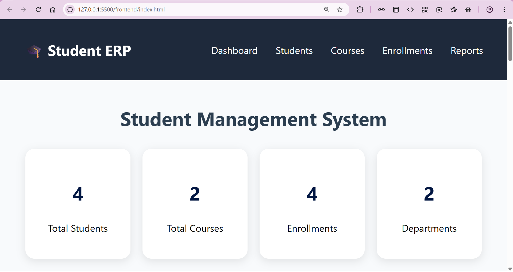
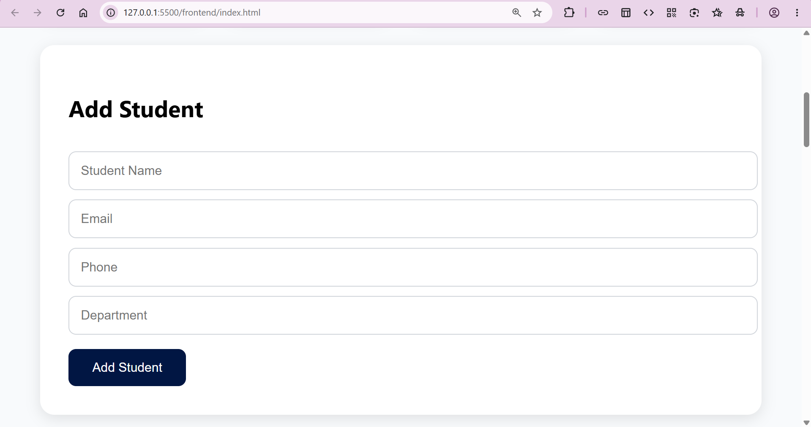
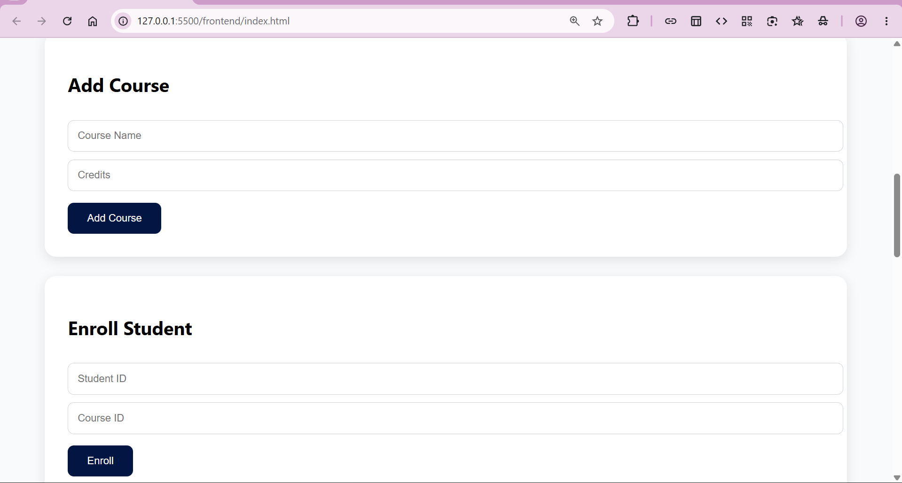
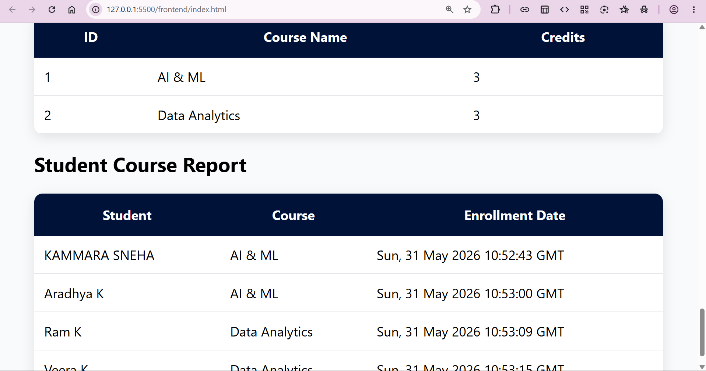
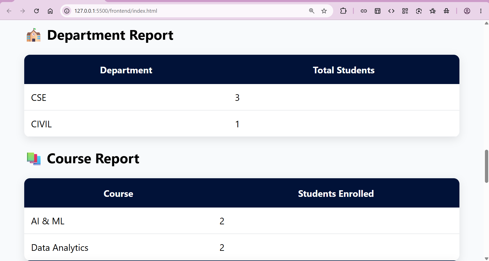

# 🎓 Student Management System

A modern web-based **Student Management System** developed using **HTML, CSS, JavaScript, Python Flask, and MySQL**.

The application helps educational institutions manage students, courses, enrollments, and reports through a simple and user-friendly interface.

---

# 🚀 Features

## 📊 Dashboard

* Total Students Count
* Total Courses Count
* Total Enrollments Count
* Total Departments Count
* Real-Time Statistics

## 👨‍🎓 Student Management

* Add New Students
* View Student Records
* Search Students
* Update Student Information
* Delete Students

## 📚 Course Management

* Add Courses
* View Available Courses
* Course Credit Management

## 📝 Enrollment Management

* Enroll Students into Courses
* Manage Student-Course Relationships
* Track Enrollment Dates

## 📈 Reports

* Student Course Report
* Department-wise Student Count
* Course-wise Enrollment Count
* Dashboard Analytics

---

# 🛠️ Technology Stack

### Frontend

* HTML5
* CSS3
* JavaScript

### Backend

* Python
* Flask
* Flask-CORS

### Database

* MySQL

### SQL Concepts Used

* Tables
* Primary Keys
* Foreign Keys
* Stored Procedures
* Views
* Joins
* Aggregate Functions
* GROUP BY
* COUNT

---

# 📂 Project Structure

```text
Student_Management/
│
├── backend/
│   ├── app.py
│   ├── db.py
│   └── requirements.txt
│
├── frontend/
│   ├── index.html
│   ├── style.css
│   └── script.js
│
├── screenshots/
│   ├── DashBoard.png
│   ├── AddStudents.png
│   ├── AddCourse.png
│   ├── StudentCourseReport.png
│   └── Reports.png
│
├── Tables.sql
├── StoredProcedure.sql
├── Views.sql
│
└── README.md
```

---

# 📸 Application Screenshots

## Dashboard



---

## Student Management



---

## Course Management



---

## Student Course Report



---

## Reports & Analytics



---

# 🗄️ Database Design

## Students Table

Stores student information:

* Student ID
* Student Name
* Email
* Phone
* Department

## Courses Table

Stores course details:

* Course ID
* Course Name
* Credits

## Enrollments Table

Stores student enrollments:

* Enrollment ID
* Student ID
* Course ID
* Enrollment Date

---

# 🔗 Database Relationships

```text
Students
    |
    |
    | StudentID
    |
Enrollments
    |
    |
    | CourseID
    |
Courses
```

### Relationship Type

* One Student → Multiple Enrollments
* One Course → Multiple Students

This creates a Many-to-Many relationship between Students and Courses.

---

# ⚙️ Installation Guide

## 1. Clone Repository

```bash
git clone https://github.com/YOUR_USERNAME/Student_Management.git

cd Student_Management
```

---

## 2. Database Setup

Open MySQL Workbench and execute:

```text
Tables.sql
StoredProcedure.sql
Views.sql
```

Create database:

```sql
CREATE DATABASE student_management;
USE student_management;
```

---

## 3. Backend Setup

Navigate to backend folder:

```bash
cd backend
```

Install dependencies:

```bash
pip install -r requirements.txt
```

Run Flask server:

```bash
python app.py
```

Backend runs on:

```text
http://127.0.0.1:5000
```

---

## 4. Frontend Setup

Open:

```text
frontend/index.html
```

or use VS Code Live Server.

Frontend runs on:

```text
http://127.0.0.1:5500
```

---

# 📡 API Endpoints

## Students

| Method | Endpoint            |
| ------ | ------------------- |
| GET    | /students           |
| POST   | /addStudent         |
| PUT    | /updateStudent/<id> |
| DELETE | /deleteStudent/<id> |

---

## Courses

| Method | Endpoint   |
| ------ | ---------- |
| GET    | /courses   |
| POST   | /addCourse |

---

## Enrollments

| Method | Endpoint        |
| ------ | --------------- |
| POST   | /enrollStudent  |
| GET    | /studentCourses |

---

## Dashboard

| Method | Endpoint          |
| ------ | ----------------- |
| GET    | /dashboard        |
| GET    | /departmentReport |
| GET    | /courseReport     |

---

# 📊 SQL Features Demonstrated

### Stored Procedures

Used for reusable database operations.

Example:

```sql
CALL AddStudent(...);
```

### Views

Used for reporting and simplified queries.

Example:

```sql
vw_StudentCourses
```

### Joins

Used to combine:

* Students
* Courses
* Enrollments

### Aggregate Functions

Used in reports:

```sql
COUNT()
GROUP BY
```

---

# 🎯 Learning Outcomes

This project demonstrates:

* Frontend Development
* Backend Development
* REST API Design
* Database Design
* SQL Queries
* Stored Procedures
* Views
* Foreign Keys
* CRUD Operations
* Reporting Systems

---

# 💼 Interview Topics Covered

* HTML Forms
* CSS Layouts
* JavaScript Fetch API
* Flask APIs
* MySQL Integration
* Primary Keys
* Foreign Keys
* Joins
* Stored Procedures
* Views
* CRUD Operations
* REST Architecture

---

# 🔮 Future Enhancements

* User Authentication
* Role-Based Access
* Export Reports to Excel
* Student Attendance Management
* Marks Management
* PDF Report Generation
* Email Notifications
* Responsive Mobile Design

---

# 👩‍💻 Author

Developed as a Full-Stack Student Management System project using HTML, CSS, JavaScript, Flask, and MySQL.

This project was built to demonstrate practical knowledge of web development, database design, and REST API development.
